This vignette demonstrates how to use cellhashR to easily run multiple demultiplexing algorithms on cell hashing data in order to produce the classifications summarized in this figure from the BFF paper.  

```{r, echo=FALSE}
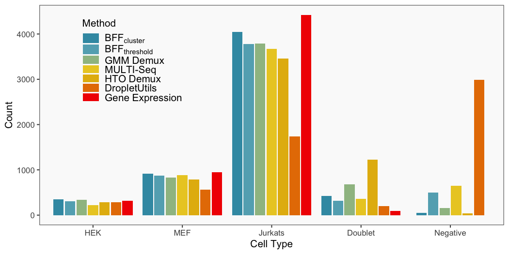
```

```{r setup1, eval=FALSE}

library(cellhashR)
knitr::opts_chunk$set(message=FALSE, warning=FALSE, echo=TRUE, error=TRUE)

```

# Load Data

```{r setup, eval=FALSE}
methods <- c("bff_cluster", "bff_threshold", "gmm_demux", "multiseq", "htodemux", "dropletutils")

rawCountData <- "/Users/boggy/bimberlab/cell_type_counts.csv"
barcodeData_t <- (read.csv(rawCountData, header = TRUE, row.names = 1))
zeros <- row.names(barcodeData_t[barcodeData_t$Bar1 == 0,])
barcodeData_t_fin <- barcodeData_t[!row.names(barcodeData_t) %in% zeros,]
barcodeData <- t(barcodeData_t_fin)
```

# Generate Hashing Calls

The cellhashR command GenerateCellHashingCalls performs demultiplexing analysis on the data using the algorithms listed in "methods".  The plots that follow are the most informative of the plots generated by each demultiplexing algorithm.

```{r GenerateCalls, fig.width=12, eval=FALSE}

df <- GenerateCellHashingCalls(barcodeMatrix = barcodeData, methods = methods, cellbarcodeWhitelist = cellbarcodeWhitelist, metricsFile = metricsFile)
write.table(df, file = callFile, sep = '\t', row.names = FALSE, quote = FALSE)

```

## BFF_cluster

```{r, echo=FALSE}
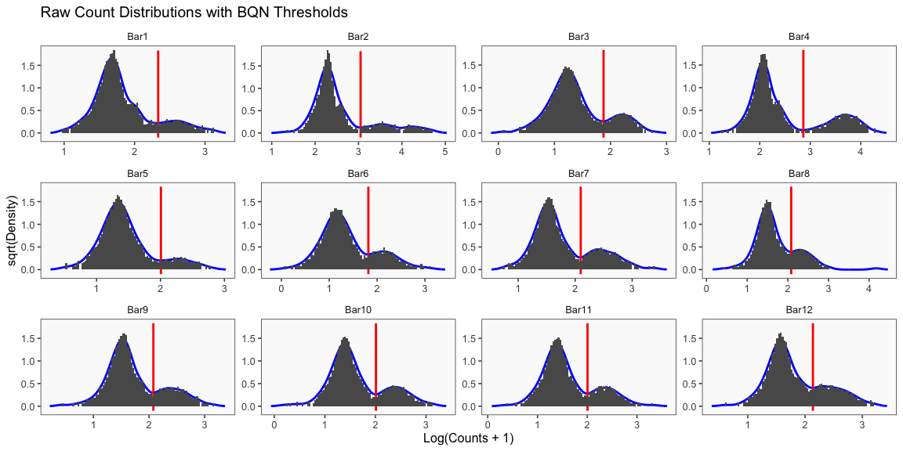
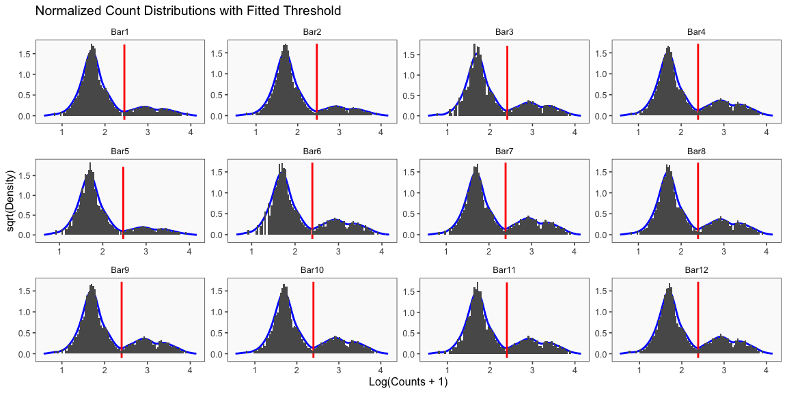
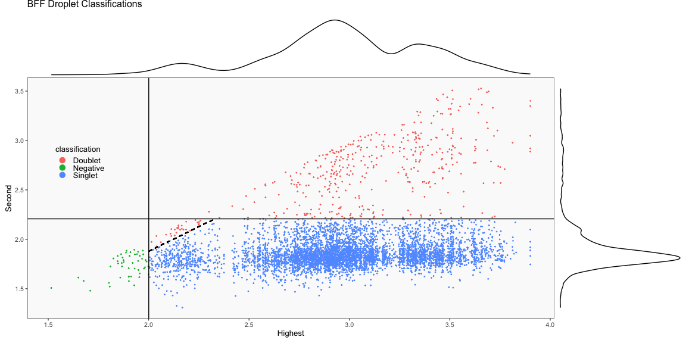
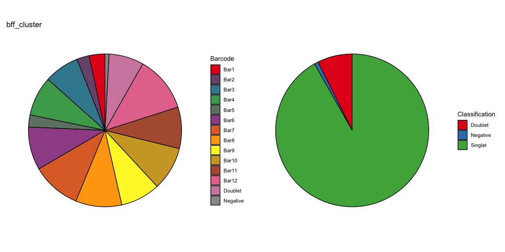
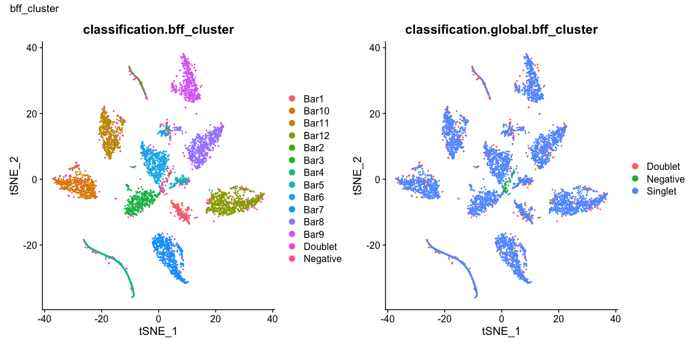
```

## BFF_threshold

```{r, echo=FALSE}
knitr::include_graphics('Benchmark-example_files/figure-html/GenerateCalls-19.png')
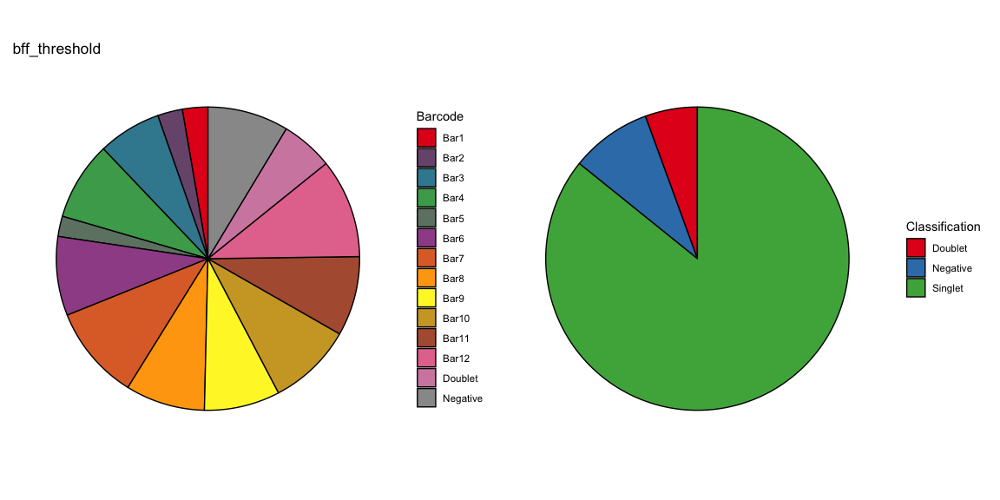

```

## GMM Demux

```{r, echo=FALSE}
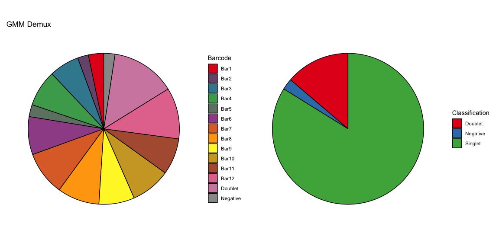
```

## MULTI-Seq

```{r, echo=FALSE}
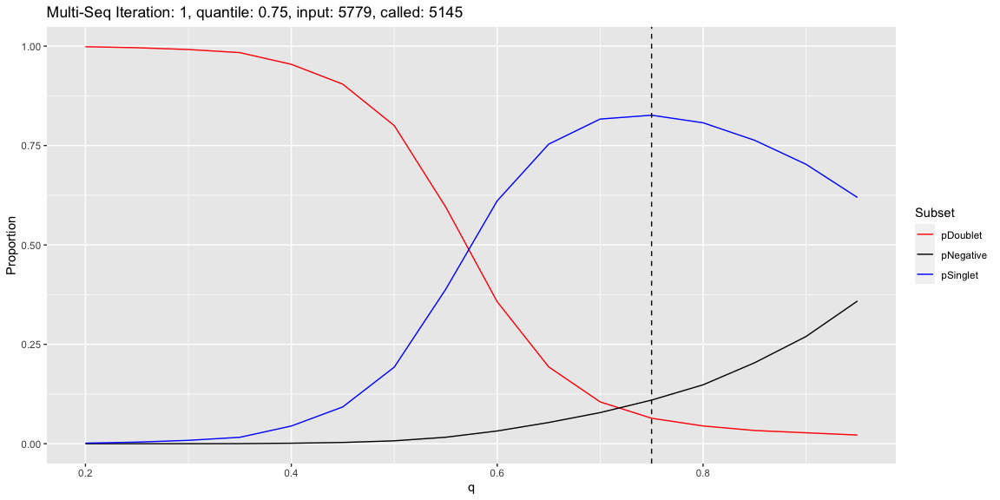
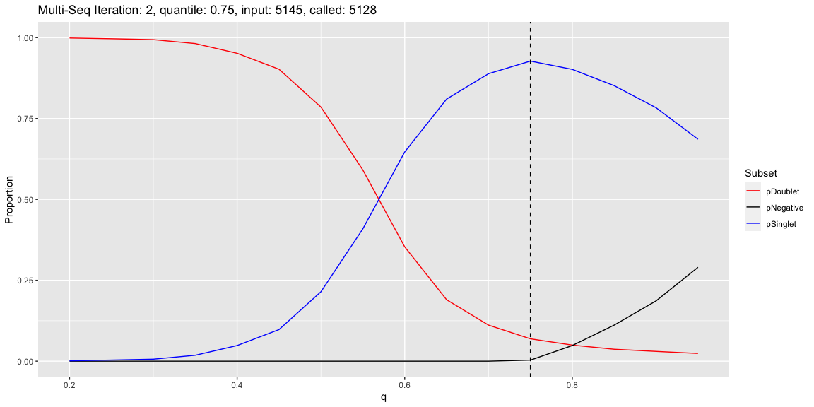
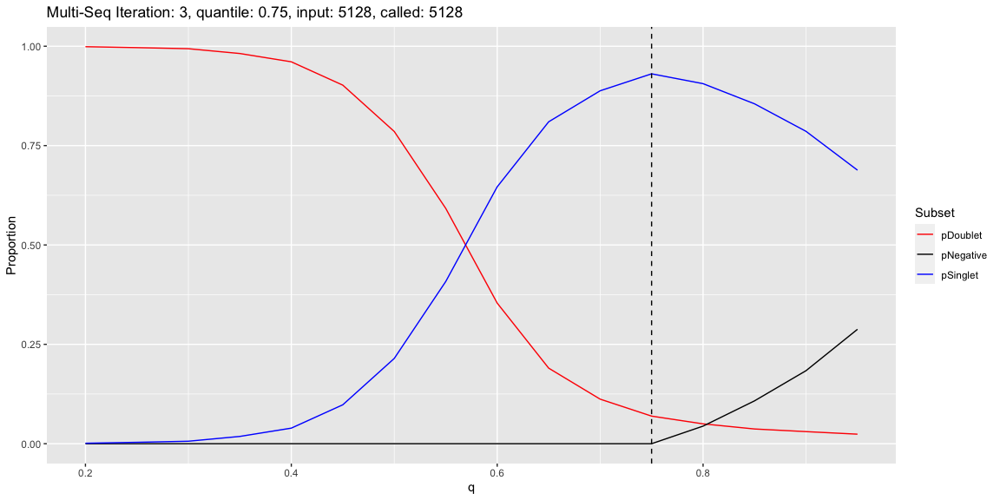
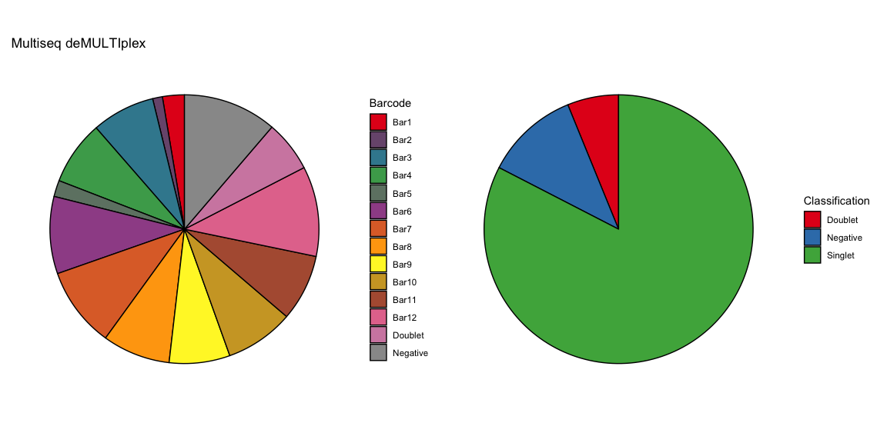
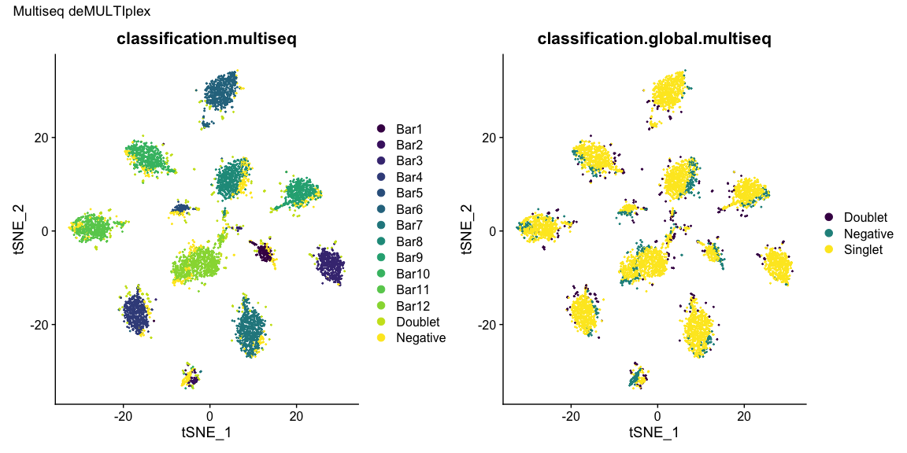
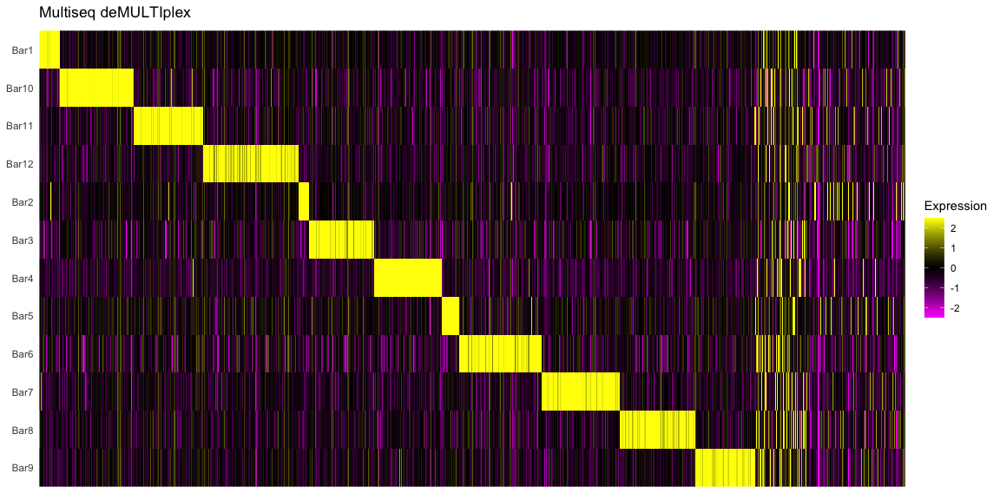
```


## Seurat HTODemux

```{r, echo=FALSE}
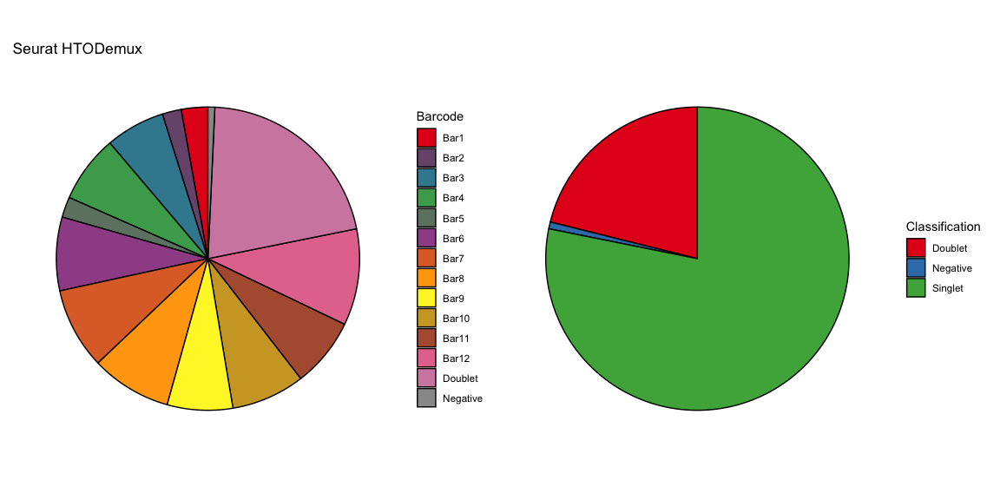
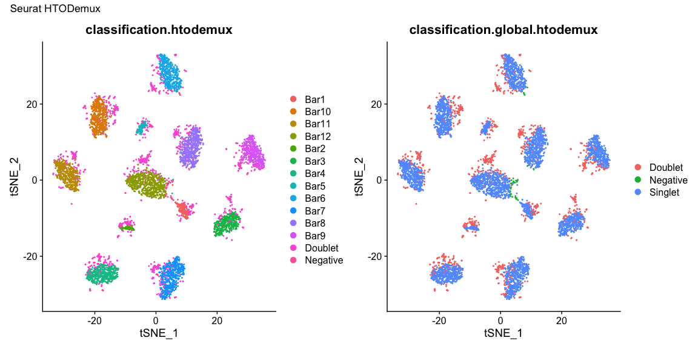
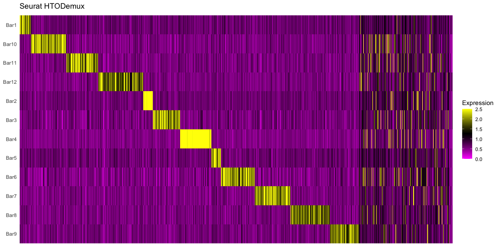
```

## DropletUtils hashedDrops

```{r, echo=FALSE}
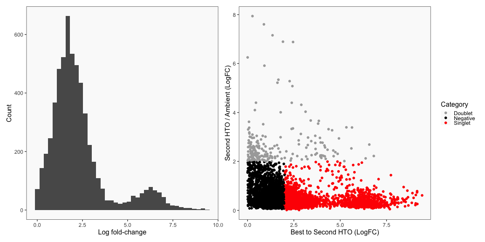
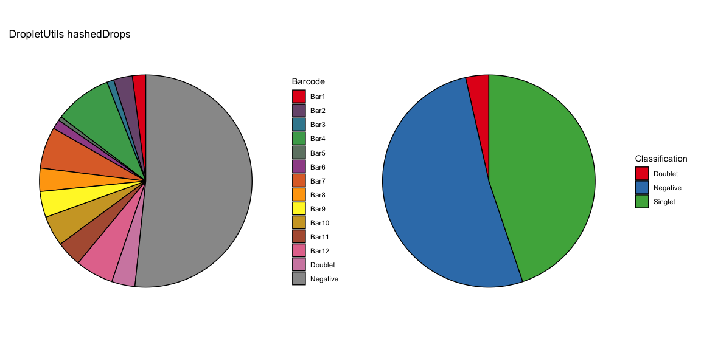
```

## Summary of Calls

After all of the demultiplexing algorithms have run, the classifications are summarized as in these plots.

```{r, echo=FALSE}
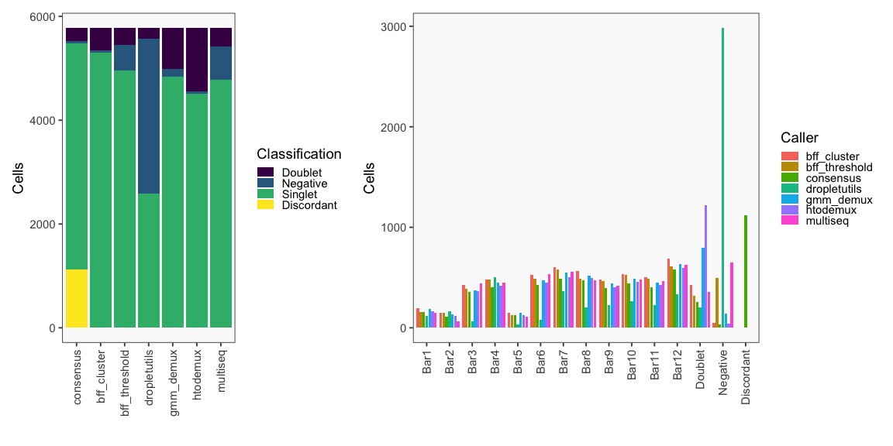
```

The classification summary above is related to the classification summary in the BFF paper (shown again below) because the HEK sample is composed of Bar1 and Bar2 droplets, the MEF sample is composed of Bar3 and Bar4 droplets, and the Jurkats sample is composed of droplets assigned to the remaining barcodes.

```{r, echo=FALSE}

```

# Calls Per Cell

The output is a data frame, with the calls from each caller, and a consensus call. See AppendCellHashing to append the results to a seurat object as metadata.

```{r, eval=FALSE}

knitr::kable(head(df, n = 10))

```

```{r, echo=FALSE}
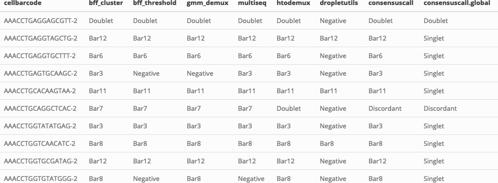
```
